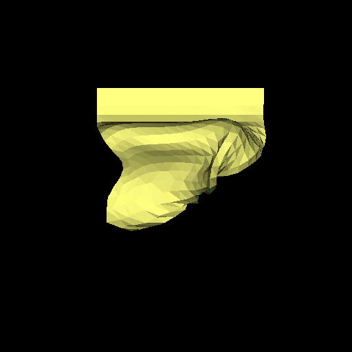

# ClothDemo

This is a simple cloth simulation demo running on linux. Skeleton code is obtained from http://www.cs.cmu.edu/~15869-f10/ as part of project 1 assignment.

It uses mass-spring model with three kind of springs to model cloth, and three kinds of explicit R-K integrator to solve the ODE.

Below are some stable results obtained by adjusting parameters.

