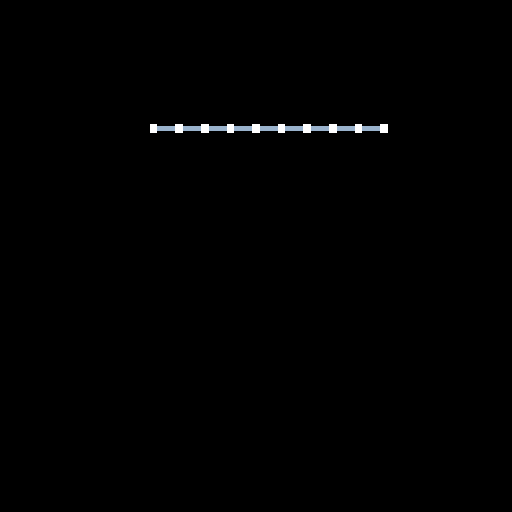

# ClothDemo

This is a simple cloth simulation demo running on linux. Skeleton code is obtained from http://www.cs.cmu.edu/~15869-f10/ as part of project 1 assignment.

It uses mass-spring model with three kinds of springs to model cloth, and can switch between three kinds of explicit R-K integrator to solve the ODE.

Below are some stable results obtained by adjusting parameters.

## 20 x 20, Lambertian Shading, the best result achieved
If this sequence cannot play a full cycle, please click directly for original source.
( http://imglf2.nosdn.127.net/img/L3pWV1luYk9ob2NoYXVlaXdHekU5WVJnd1g5VnJGQktrYzhlbWhBVzRZaUc0cHViSTNqTGt3PT0.gif ).

## 10 x 10, Default Rendering, the first stable result

